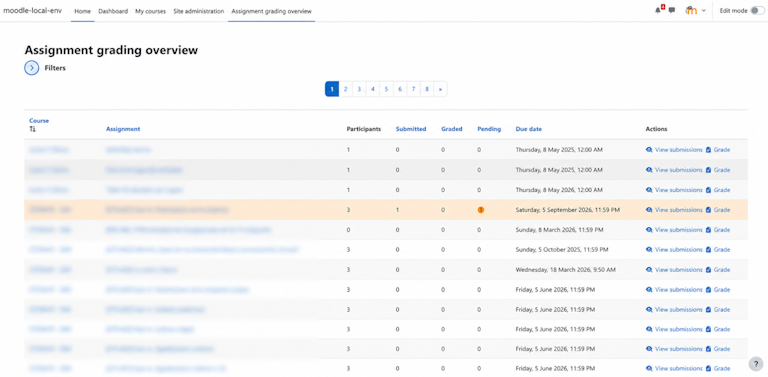
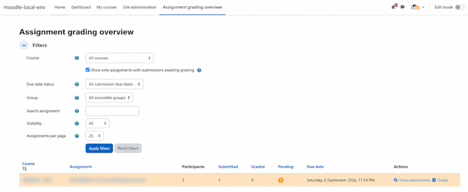
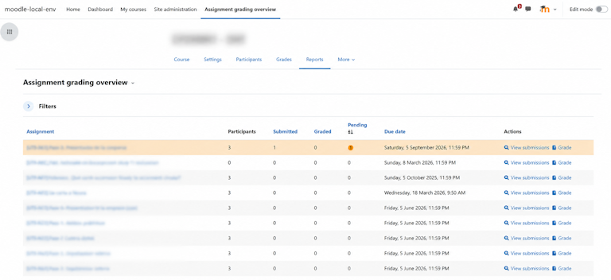
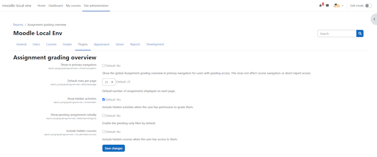

# Assignment grading overview

`report_assigngradingoverview` is a Moodle report plugin that gives teachers a clear overview of the grading status of Assignment activities (`mod_assign`). It helps graders quickly identify submitted work, pending grading and assignments that need attention across one course or across all accessible courses.

The plugin is read-only. It links to Moodle's standard Assignment submission and grading pages, but it does not replace the grader, modify submissions or change grades.

## Plugin Information

| Item | Value |
| --- | --- |
| Plugin type | Report plugin |
| Moodle component | `report_assigngradingoverview` |
| Installation path | `report/assigngradingoverview` |
| Compatibility | Moodle 4.5 or later |
| Main scope | Assignment grading overview |
| Activity support | Standard Moodle Assignment activity (`mod_assign`) |
| License | GNU GPL v3 or later |

## Features

- Site-wide overview of assignments the current user can grade.
- Course report integrated into Moodle's standard **Reports** navigation and report selector.
- Live grading status counts, with submitted and pending counters calculated efficiently through aggregate queries.
- Filters for course, group, assignment name, due date status, visibility and pending work.
- Sortable and paginated table based on Moodle's native table API.
- Direct links to view submissions and open the Assignment grader.
- Optional primary-navigation entry for the global report.
- English and Spanish language packs.

## Screenshots

**Global report**



**Filters**



**Course report**



**Plugin settings**



## Requirements

- Moodle 4.5 or later.
- A PHP version supported by the installed Moodle release.
- The standard Moodle Assignment activity (`mod_assign`).

The minimum required Moodle build is `2024100700`.

## Installation

1. Copy the plugin directory to `report/assigngradingoverview`.
2. Visit **Site administration > Notifications** or run:

   ```bash
   php admin/cli/upgrade.php
   ```

3. Review the plugin settings under **Site administration > Plugins > Reports > Assignment grading overview**.

The plugin does not create custom database tables and does not require a scheduled task.

## Access and Permissions

Access is controlled through Moodle capabilities. Users need `report/assigngradingoverview:view` in the course context and `mod/assign:grade` in the assignment context to see an assignment in the report.

By default, the report capability is granted to managers, editing teachers and teachers. Administrators can adjust this through Moodle's standard role and permission settings.

The course report is available from the course Reports area when the user has access and there is at least one gradable assignment. The global report can optionally be shown in the primary navigation.

## Settings

Administrators can configure whether the global report appears in primary navigation, the default number of assignments per page, hidden activity visibility, the initial pending-only filter state and whether hidden courses can be included when the user has access to them.

The primary-navigation entry and hidden-course inclusion are disabled by default.

## Data and Privacy

The report reads information from Moodle when it is displayed. It stores no personal data, report filters or user preferences. A short-lived session cache may store whether the global navigation entry is available for the current user. The report does not list individual students or expose submission contents.

Submitted and pending counters are calculated with aggregate queries that mirror Moodle Assignment behaviour. Participant counts continue to use the Assignment API for the visible rows, so enrolments, groups, availability and module rules remain consistent with Moodle.

## Performance

Assignment metadata is filtered through Moodle database API. Submitted and pending counters are calculated with aggregate SQL, while participant counts are loaded through `mod_assign` only for the rows shown on the current page. This keeps the report responsive on sites with many gradable assignments while preserving Moodle grading semantics.

## Scope

The plugin focuses on Assignment activities only. It does not report on quizzes, forums, workshops, gradebook items or third-party activity modules.

## Credits

Developed and maintained by Javier Caceres Gonzalez.

Special thanks to [@SergioComeron](https://github.com/SergioComeron) for improving the performance of the aggregate counters.

## License

This plugin is licensed under the GNU GPL v3 or later. See [LICENSE](LICENSE).
